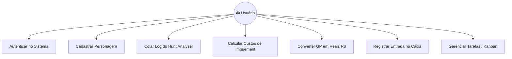
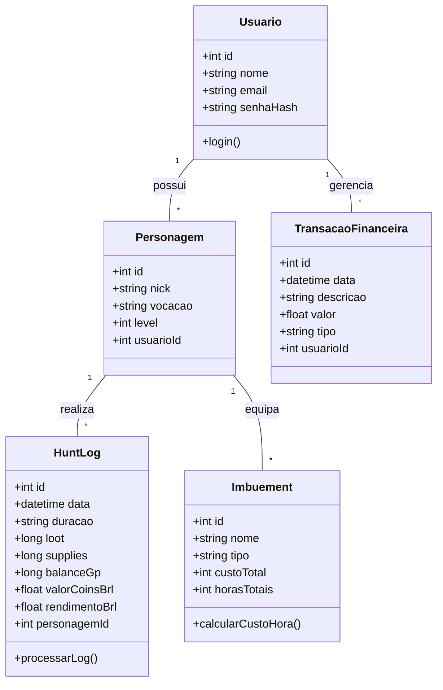
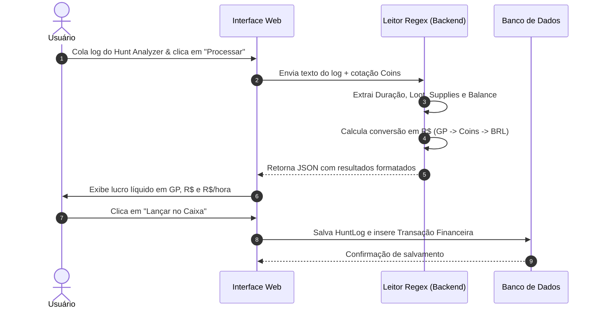

# 🚀 Segunda Tela - Gerenciador de Farm e Gestão Financeira

> **Projeto Integrador / Trabalho de Conclusão de Curso (TCC)**  
> **Curso:** Engenharia de Software  
> **Professor Orientador:** Prof. Arnaldo  

---

## 📌 1. Título do Projeto
**Segunda Tela - Gerenciador de Farm e Gestão Financeira**

---

## 📝 2. Descrição Geral
O **Segunda Tela** é uma plataforma web integrada concebida como um *dashboard* em tempo real para gamers e desenvolvedores. O sistema unifica a gestão de rotina e o controle financeiro pessoal a um módulo especializado na economia de MMORPGs (**MMORPG Farm Manager**).

### Problema
Jogadores e *farmers* de MMORPG frequentemente enfrentam dificuldades em mensurar o lucro líquido real de suas sessões de jogo (*hunts*), devido à flutuação no preço das moedas virtuais (*Game Coins*), custo invisível de desgaste de suprimentos/equipamentos por hora e despesas fixas da vida real.

### Solução
A aplicação automatiza o *parsing* dos logs do *Hunt Analyzer*, calcula a margem de lucro real descontando insumos e imbuimentos, converte os ganhos virtuais em Reais (R$) e integra esses valores diretamente ao fluxo de caixa pessoal e quadro de produtividade.

---

## 🌐 3. Domínio na Internet
* **Domínio Principal:** `https://segundatela-farmmanager.app`
* **Domínio Alternativo (Subdomínio TCC):** `https://tcc.segundatela.com.br`

---

## 🛠️ 4. Stack de Tecnologia

| Camada | Tecnologia | Justificativa |
| :--- | :--- | :--- |
| **Frontend** | HTML5, CSS3 (Flexbox/Grid), JavaScript (ES6+) | Interface leve em *Dark Mode*, otimizada para execução em segundo monitor ("Segunda Tela"). |
| **Prototipagem UI/UX** | Figma | Wireframes e fluxo de interação do usuário. |
| **Backend (API)** | Python (FastAPI / Flask) ou Node.js | Processamento de logs, expressões regulares (Regex) e cálculos financeiros. |
| **Banco de Dados** | SQLite / PostgreSQL | Estrutura relacional para histórico de hunts, transações e personagens. |
| **Controle de Versão** | Git & GitHub | Versionamento e documentação técnica. |
| **Hospedagem** | Vercel (Frontend) / Render (Backend) | Deploy contínuo (CI/CD) integrado ao GitHub. |

---

## 📱 5. Telas do Sistema (Mockups)

### 🖥️ Tela 01: Login & Seleção de Personagem
```html
+-----------------------------------------------------------------------+
|  ⚔️ SEGUNDA TELA - AUTENTICAÇÃO                                        |
+-----------------------------------------------------------------------+
|                                                                       |
|   Usuário:  [ admin@segundatela.com                      ]             |
|   Senha:    [ ****************                           ]             |
|                                                                       |
|   Selecione o Personagem Ativo:                                       |
|   (o) Main Char (Knight - Lv 450)                                     |
|   ( ) Secondary Char (Sorcerer - Lv 320)                              |
|                                                                       |
|   [ 🚀 Entrar no Sistema ]                                            |
+-----------------------------------------------------------------------+
```

### 🖥️ Tela 02: Dashboard Principal
```html
+-----------------------------------------------------------------------+
|  🎮 MMORPG FARM MANAGER |  💰 CAIXA: R$ 1.450,00      | 📋 TAREFAS: 3  |
+-----------------------------------------------------------------------+
|  [➕ Registrar Hunt]  [⚙️ Imbuements]  [💵 Finanças]  [📌 Kanban]     |
|-----------------------------------------------------------------------|
|  MÉTRICAS DO DIA:                                                     |
|  +---------------------+ +--------------------+ +-------------------+ |
|  | Tempo de Jogo: 2h30m| | Profit GP: 1.8M gp | | Rendimento: R$72.00| |
|  +---------------------+ +--------------------+ +-------------------+ |
+-----------------------------------------------------------------------+
```

### 🖥️ Tela 03: Leitor de Hunt Analyzer & Conversor
```html
+-----------------------------------------------------------------------+
|  📋 LEITOR DE LOG DO HUNT ANALYZER                                    |
+-----------------------------------------------------------------------+
| [ Session data: From 2026-10-01... Balance: 1,400,000 gp            ] |
|-----------------------------------------------------------------------|
| COTAÇÃO: 250 Coins = 9.500.000 gp | 250 Coins = R$ 42,00              |
|-----------------------------------------------------------------------|
| RESULTADOS PROCESSADOS:                                               |
| - Duração: 01:30h          - Loot Total: 1.800.000 gp                |
| - Supplies: 400.000 gp     - Lucro Líquido: 1.400.000 gp             |
| 💰 RENDIMENTO REAL: R$ 26,52  |  📈 TAXA HORA: R$ 17,68/h             |
|                                                                       |
| [ 💾 Salvar no Histórico ]   [ 💵 Lançar Entrada no Caixa ]            |
+-----------------------------------------------------------------------+
```

### 🖥️ Tela 04: Calculadora & Gestão de Imbuiments
```html
+-----------------------------------------------------------------------+
|  ⚙️ GESTÃO DE IMBUEMENTS (CUSTO POR HORA)                             |
+-----------------------------------------------------------------------+
| Item           | Custo Total (20h) | Custo / Hora  | Status Equip.    |
|----------------|-------------------|---------------|------------------|
| Mana Leech     | 300.000 gp        | 15.000 gp/h   | 🟢 14h restantes |
| Critical Strike| 450.000 gp        | 22.500 gp/h   | 🟡 03h restantes |
| Life Leech     | 280.000 gp        | 14.000 gp/h   | 🔴 Expirado      |
|-----------------------------------------------------------------------|
| CUSTO TOTAL DE IMBUEMENTS POR HORA: 51.500 gp/h (~R$ 0,97/h)           |
+-----------------------------------------------------------------------+
```

### 🖥️ Tela 05: Gestão Financeira Pessoal
```html
+-----------------------------------------------------------------------+
|  💰 CONTROLE FINANCEIRO INTEGRADOR                                    |
+-----------------------------------------------------------------------+
|  Data       | Origem / Descrição        | Categoria | Valor (R$)      |
|-------------|---------------------------|-----------|-----------------|
|  01/10/2026 | Farm Hunt MMORPG          | Jogo/Farm | + R$ 26,52      |
|  02/10/2026 | Internet Fibra            | Contas    | - R$ 120,00     |
|  03/10/2026 | Venda de Game Coins       | Jogo/Farm | + R$ 210,00     |
+-----------------------------------------------------------------------+
```

### 🖥️ Tela 06: Quadro Kanban de Produtividade
```html
+-----------------------------------------------------------------------+
|  📌 BOARD DE TAREFAS (TRELLO STYLE)                                   |
+-----------------------------------------------------------------------+
| A FAZER [ ]            | EM ANDAMENTO [/]       | CONCLUÍDO [X]       |
|------------------------|------------------------|---------------------|
| - Modelar DB Postgres  | - Criar Wireframe Figma| - MVP do Leitor Hunt|
| - Documentar ADR-001   | - Redigir Cap. 1 TCC   | - Configurar Git Repo|
+-----------------------------------------------------------------------+
```

---

## 📐 6. Diagramas UML

### 📊 6.1. Diagrama de Casos de Uso


### 🏗️ 6.2. Diagrama de Classes


### 🔄 6.3. Diagrama de Sequência (Processamento de Hunt)


---

## 📊 7. Estrutura de Dados (Modelo de Tabelas)

### Tabela 1: `tb_usuario`
| ID (`id`) | Nome (`nome`) | Email (`email`) | Data Cadastro (`created_at`) |
| :--- | :--- | :--- | :--- |
| 1 | Leo Rick | leorick@email.com | 2026-10-01 10:00:00 |

### Tabela 2: `tb_personagem`
| ID (`id`) | ID Usuário (`usuario_id`) | Nick (`nick`) | Vocação (`vocacao`) | Level (`level`) |
| :--- | :--- | :--- | :--- | :--- |
| 101 | 1 | Main Char | Knight | 450 |
| 102 | 1 | Secondary Char | Sorcerer | 320 |

### Tabela 3: `tb_hunt_log`
| ID (`id`) | ID Personagem (`personagem_id`) | Duração (`duracao`) | Loot (GP) (`loot`) | Supplies (GP) (`supplies`) | Balance (GP) (`balance`) | Cotação 250 Coins (`coins_brl`) | Total (R$) (`rendimento_brl`) |
| :--- | :--- | :--- | :--- | :--- | :--- | :--- | :--- |
| 5001 | 101 | 01:30 | 1800000 | 400000 | 1400000 | 42.00 | 26.52 |

### Tabela 4: `tb_imbuement`
| ID (`id`) | Nome (`nome`) | Custo Itens (GP) (`custo_itens`) | Custo Token (GP) (`custo_token`) | Duração (Horas) (`duracao_h`) | Custo por Hora (GP) (`custo_hora_gp`) |
| :--- | :--- | :--- | :--- | :--- | :--- |
| 1 | Mana Leech | 250000 | 50000 | 20 | 15000 |
| 2 | Critical Strike | 400000 | 50000 | 20 | 22500 |

### Tabela 5: `tb_transacao_financeira`
| ID (`id`) | ID Usuário (`usuario_id`) | Descrição (`descricao`) | Tipo (`tipo`) | Categoria (`categoria`) | Valor (R$) (`valor`) | Data (`data`) |
| :--- | :--- | :--- | :--- | :--- | :--- | :--- |
| 8001 | 1 | Farm Hunt MMORPG | ENTRADA | Farm / Jogo | 26.52 | 2026-10-01 |
| 8002 | 1 | Internet Fibra | SAÍDA | Contas Fixas | 120.00 | 2026-10-02 |

---
